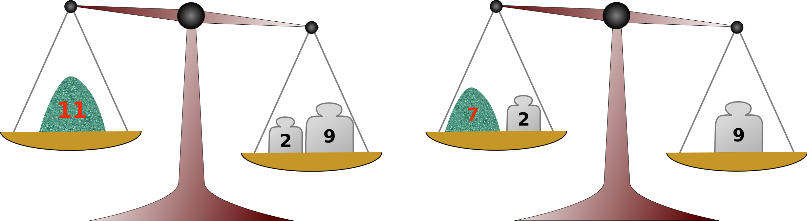

# icpc2019
ICPC2019の解答例


# 問題A：期末試験の成績

私は，中学校の教師である． ちょうど期末試験が終わったところで，すべての科目について全生徒の点数が手元にある． どれぐらい高い合計点を得た生徒がいるのか知りたいのだが，科目ごとの得点データになっているので，作業が容易でない． そこで，優秀なプログラマであるあなたに手助けしてほしい． 具体的には，合計点が最も高い生徒の合計点を求めるプログラムを書いてほしい．

### Input
入力は複数のデータセットからなる． 各データセットは次の形式で表される．
```
n m  
p1,1 p1,2 … p1,n  
p2,1 p2,2 … p2,n  
…  
pm,1 pm,2 … pm,n  
```

データセットの最初の行は，二つの整数 n と m からなる． n は生徒の人数 (1 ≤ n ≤ 1000)，m は科目数 (1 ≤ m ≤ 50) である． それに続く m 行のそれぞれには，特定の科目に対する n 人の生徒の得点がある． pj,k は，生徒 k の科目 j に対する得点を表す整数である (1 ≤ j ≤ m，1 ≤ k ≤ n)． この値は，0 ≤ pj,k ≤ 1000 を満たす．

入力の終わりは二つのゼロからなる行で表される． データセットの個数は 100 を超えない．

### Output
各データセットについて，合計点が最も高い生徒の合計点を出力せよ． 生徒 k の合計点 sk とは sk = p1,k + … + pm,k のことである．

### Sample Input
```
5 2  
10 20 30 40 50  
15 25 35 45 55  
6 3  
10 20 30 15 25 35  
21 34 11 52 20 18  
31 15 42 10 21 19  
4 2  
0 0 0 0  
0 0 0 0  
0 0  
```

### Output for the Sample Input
```
105  
83  
0  
```

## 方針  

入力データが何を表しているか，何を出力するかを，確実に理解しよう．  
今回のデータは，m行の各行に各科目の得点があり，左から生徒1，生徒2，．．．，生徒nの得点になっている．  
出力するのは，合計点の最も高い生徒の得点なので，列ごとの合計を求め，その最大値を表示すればよい．

プログラムに不慣れな人は，変数や配列・リスト等に値を代入する処理を作成するタイミングで，正しく値が格納されているか，画面表示して確認することをお勧めする（以下のプログラムでも，あちこちで確認している．最終的にはコメントアウトすればよい）


```python
while True:
    n, m = list(map(int, input().split()))
    # print(n, m)

    if n == 0 and m == 0:
        break

    p = []
    for i in range(m):
        p.append(list(map(int, input().split())))
    # print(p)

    total = [0] * n   # 各生徒の合計点数の初期化
    for i in range(m):
        for j in range(n):
            total[j] += p[i][j]
    # print(total)

    print(max(total))

```

# 問題B：スクリーンキーボード

リモコンでスクリーンキーボードを操作して文字列を入力したい. リモコンには 4 方向の矢印と OK のボタンがついている（図 B-1）． 与えられた文字列を与えられたスクリーンキーボードで入力するのに必要な最小ボタン押下回数を求めよ.


図 B-1 リモコン


図 B-2 スクリーンキーボードの例

|入力する文字  |強調表示の動き  |ボタン操作  |
|:-:|:-:|:-:|
|I  |  |→,→,→,→,→,→,→,→,OK（9回）  |
|C  | |←,←,←,←,←,←,OK（7回）  |
|P  |  |↓,→,→,→,→,OK（6回）  |
|C  |  |↑,←,←,←,←,OK（6回）  |
	
図 B-3 図 B-2 のスクリーンキーボードで “ICPC” を入力する最短の手順

スクリーンキーボードは格子状に並んだセルからなり, 各セルには文字がひとつあるか空である. 複数のセルが同じ文字を含むことはない．

スクリーンキーボードのセルのひとつは強調表示されていて, 空でないセルが強調表示されているときにリモコンの OK ボタンを押すと, そのセルの文字が入力される.

最初はスクリーンキーボードの左上隅のセルが強調されている． 矢印ボタンのひとつを押すと, 強調セルはその矢印の示す方向の隣のセルに移る. 強調セルがスクリーンキーボードの端にあるときには, スクリーンキーボードから出るような方向の矢印ボタンを押しても何も起きない.

例えば図 B-2 に示すスクリーンキーボード上で文字列 “ICPC” を入力するには, 図 B-3 に示す手順でボタンを 28 回押せばよい. これが最小ボタン押下回数である.

スクリーンキーボードのセルに入っている文字は, 英小文字 (‘a’, ‘b’, ..., ‘z’)， 英大文字 (‘A’, ‘B’, ..., ‘Z’)， 数字 (‘0’, ‘1’, ..., ‘9’)， コンマ (‘,’)， ハイフン (‘-’)， ピリオド (‘.’)， スラッシュ (‘/’)， コロン (‘:’)， セミコロン (‘;’)， アットマーク (‘@’) のいずれかである．

### Input
入力は次の形式の最大 100 個のデータセットからなる．

```
h w  
r1  
...  
rh  
s  
```

データセットの最初の行のふたつの整数 h と w は，それぞれスクリーンキーボードの高さと幅である．これらは空白で区切られており, 1 ≤ h ≤ 50 と 1 ≤ w ≤ 50 を満たす.

続く h 行に，スクリーンキーボードの各行が与えられる． i 番目の行 ri はスクリーンキーボードの i 行目を表している． ri は長さ w の文字列であり，スクリーンキーボードの i 行目の文字が左から順に並んだものである． ただし，スクリーンキーボード上の空のセルは，アンダースコア (‘_’) で表現されている．

スクリーンキーボードは上述の条件を満たす．

続く行の s は，長さ 1 以上 1000 以下の，入力したい文字列である． s に含まれる文字は，必ず与えられたスクリーンキーボード上に存在する． s はアンダースコアを含まないことに注意．

入力の終わりはゼロふたつからなる行で表される．

### Output
各データセットについて，与えられた文字列を与えられたスクリーンキーボードで入力するのに必要な最小ボタン押下回数を表す整数ひとつをもつ行を出力せよ．

### Sample Input
```
3 9  
ABCDEFGHI  
JKLMNOPQR  
STUVWXYZ_  
ICPC  
5 11  
___________  
____A______  
________M__  
___________  
_C_________  
ACM  
4 21  
1_2_3_4_5_6_7_8_9_0_-  
QqWwEeRrTtYyUuIiOoPp@  
AaSsDdFfGgHhJjKkLl;_:  
ZzXxCcVvBbNnMm,_._/__  
ICPC2019,AsiaYokohamaRegional,QualificationRound  
0 0  
```

### Output for the Sample Input
```
28  
23  
493  
```

## 方針  
「複数のセルが同じ文字を含むことはない」ので，次の文字の位置を獲得し，現在の位置から移動するのに必要なボタン操作の回数を求める処理を繰り返せばよい．

カーソルの移動量は，移動前後の位置における横方向の差，および縦方向の差の合計になる（マンハッタン距離）．最後のOKボタンを押すことをお忘れなく．


```python
while True:
    h, w = list(map(int, input().split()))
    if h == 0 and w == 0:
        break
    # print(h, w)

    r = []
    for i in range(h):
        r.append(input())
    # print(r)

    s = input()
    # print(s)

    cx, cy = 0, 0   # カーソルの初期位置
    n_move = 0      # ボタンを押した回数
    for moji in s:  # 先頭文字から順にチェック
        for y in range(h):
            x = r[y].find(moji)
            # スクリーンキーボードの y行目 r[y] に 探している文字があるなら
            if x >= 0:
                n_move += ( abs(cx - x) + abs(cy - y) + 1)
                cx, cy = x, y
                break
    print(n_move)
```

# 問題C：天秤

実験化学者のあなたは粉末薬品の計量用に天秤ひとつと分銅のセットを持っている.

作業効率上, 1 回の計量には天秤を 1 回使うだけにしたい. セット中の分銅は同時にいくつ使ってもよく, 天秤の薬品と反対側に置いても同じ側に置いてもよい. たとえば 2 単位と 9 単位の分銅があれば, 2 単位, 9 単位だけでなく, 薬品と反対側に両方の分銅を置けば 11 単位 (図 C-1 左), 片方を薬品と同じ側に置けば 7 単位の薬品を量り取ることができる (図 C-1 右). 効率的に量り取れる量はこれらだけである.


図 C-1 薬品 11 単位と 7 単位の計測法

手元に今日計量する薬品量のリストがある. しかし手持ちの分銅セットだけでは, 計量リスト中の量すべてを効率的に量れるとは限らない. その場合はもうひとつだけ分銅を買ってきて補ってもよいのだが, 重い分銅ほど高価なので, なるべく軽いもので済ませたい.

なお, どんな正の重さの分銅でも売っているが, 負の重さのものはない.

### Input
入力は次の形式の最大 100 個のデータセットからなる.

```
n m  
a1 a2 ... an  
w1 w2 ... wm  
```

データセットの最初の行の n と m は, それぞれ計量リスト中の薬品量の数とセット中の分銅の個数である. これらは空白で区切られており, 1 ≤ n ≤ 100 と 1 ≤ m ≤ 10 を満たす整数である.

次の行には計量リスト中の n 種の量 a1 から an が空白区切りで並ぶ. 各 ai は 1 ≤ ai ≤ $10^9$ を満たす整数で, i ≠ j ならば ai ≠ aj である.

データセットの最後の 3 行目には, 手持ちの m 個の分銅の重さ w1 から wm が空白区切りで並ぶ. 各 wj は 1 ≤ wj ≤ $10^8$ を満たす整数である. 分銅は同じ重さのものがいくつもあるかもしれない.

入力の終わりはゼロふたつからなる行で表される．

### Output
各データセットについて以下に指示する整数ひとつからなる 1 行を出力せよ.

- 分銅を追加せずに計量リスト中のすべての量が量り取れるなら 0.
- 分銅ひとつの追加で計量リスト中のすべての量が量り取れるようになるなら, そのような分銅のうちもっとも軽いものの重さ. 追加する分銅は $10^8$ より重くてもよい.
- 分銅ひとつの追加では計量リスト中のすべての量を量り取れるようにならないなら, -1.

### Sample Input
```
4 2  
9 2 7 11  
2 9  
6 2  
7 3 6 12 16 9  
2 9  
5 2  
7 3 6 12 17  
2 9  
7 5  
15 21 33 48 51 75 111  
36 54 57 93 113  
0 0  
```
  
### Output for the Sample Input
```
0  
5  
-1  
5  
```
  

## 方針  
分銅の数 m の最大値が10と小さいので，分銅の数について総当たりしても問題ない点に注目する．

(1) 現在のm個の分銅で測定可能な重さを列挙する  
(2) 測定したい計量リスト a のうち，測定可能な重量を省く．ここでaが空になれば0を出力．  
(3) 追加できる分銅は1個までなので，なおa内に残る測定不可能な重量を1つ選択して，その重量を測定するために追加する分銅の重さを設定する．分銅の重さは2通りある．  
(4) その分銅1つを追加することで，a内のすべての重さが測定可能か確認する．測定可能なら，その分銅の重さがこれまでで最軽量だったか確認して，最軽量ならその重さを保存しておく．  
(5) a内のすべての重さが測定可能な分銅がなければ -1を出力．1つでも存在すれば記憶して置いた最軽量を出力．  


```python
while True:
    n, m = list(map(int, input().split()))
    if n == 0 and m == 0:
        break
    # print(n, m)

    a = set(map(int, input().split()))
    w = list(map(int, input().split()))
    # print('a =', a)

    # w で測定可能な重さ集合を作成
    possibles = {0}
    for e_w in w:
        tmp_possibles = possibles.copy()
        for e_possibles in possibles:
            tmp_possibles.add(e_w + e_possibles)        # ケース1
            tmp_possibles.add(abs(e_w - e_possibles))   # ケース2
        possibles = tmp_possibles
    possibles.discard(0)
    # print('possibles =', possibles)

    # 測定可能な重さを a から除去する
    a -= possibles
    if len(a) == 0:
        print(0)
        continue
    # print('left a =', a)

    # 測定不可能な重さを1つ獲得
    left_a0 = list(a)[0]

    # 測定可能な値ごとに，追加する分銅の重さを設定して，全て測定可能か確認
    min_add_w = 10**9
    for e_possibles in possibles:
        add_w = e_possibles + left_a0       # ケース1
        if add_w < min_add_w:
            # add_w の分銅を追加して，すべての a を実現できるか確認
            for e_a in a:
                if e_a + add_w not in possibles and abs(e_a - add_w) not in possibles:
                    break
            else:
                min_add_w = add_w

        add_w = abs(e_possibles - left_a0)  # ケース2
        if add_w < min_add_w:
            # add_w の分銅を追加して，すべての a を実現できるか確認
            for e_a in a:
                if e_a + add_w not in possibles and abs(e_a - add_w) not in possibles:
                    break
            else:
                min_add_w = add_w
    if min_add_w < 10**9:
        print(min_add_w)
    else:
        print(-1)
```

# 問題D：計数カウンタ

計数カウンタが何個か並んでいる． カウンタのボタンを押すと表示されている値が一つ増える． ただし，値が既に最大値なら，値は 1 に戻る． カウンタは全て同じモデルで最大値も同じである．


図 D-1 計数カウンタ

各カウンタに表示されている値から始めて，各々について指定される目的の値に変えたい． しかし多数のカウンタのボタンを一つ一つ押していくのは面倒なので，特殊な道具を作った． これを使うと，1 回の操作で隣接する一連のカウンタのボタンを 1 回ずつ押せるのだ． 対象とするカウンタの範囲は，操作 1 回ごとにどこからどこまででも自由に決められる．

各カウンタに表示されている値を目的の値に変えるのに最低何回の操作が必要だろうか．

### Input
入力は複数のデータセットからなる． 各データセットは次の形式で表される．

```
n m   
a1 a2 ... an   
b1 b2 ... bn   
```
各データセットは 3 行からなる． 1 行目には，カウンタの個数を表す n (1 ≤ n ≤ 1000) と，カウンタに表示される最大値を表す m (1 ≤ m ≤ 10000) が与えられる． 2 行目には，各カウンタの最初の値を表す ai (1 ≤ ai ≤ m) が空白区切りで与えられる． 3 行目には，各カウンタの目的の値を表す bi (1 ≤ bi ≤ m) が空白区切りで与えられる．

入力の終わりは，二つのゼロからなる行で表される． データセットの個数は 100 を超えない．

### Output
各データセットについて，全てのカウンタにそれぞれ目的の値を表示させるのに必要な最小の操作回数を 1 行に出力せよ．

### Sample Input
```
4 5  
2 3 1 4  
2 5 5 2  
3 100  
1 10 100  
1 10 100  
5 10000  
4971 7482 1238 8523 1823  
3287 9013 9812 297 1809  
0 0  
```

### Output for the Sample Input
```
4  
0  
14731  
```

## 方針：  
DPで解く．目標の数値にするカウンタを左から順に1つずつ拡張させる．  

現在の数値aと目標の数値bを比べ，最低何回押す必要があるか計算する．実際には最低回数ではなく，k周分余分に押す方が全体として押す回数が少なくなる場合がある．全部のカウンタの最大値は共通なので，n個全部のカウンタをn周以上余分に押すことが，ボタンを押す最小回数になることはない．したがって，kの範囲は0 ≦ k ≦ n - 1 で十分である．

カウンタ i に対して，目標値にするために押す回数の候補となる配列（リスト）c[i] を作成する．最低回数をc0とすると，続く要素は c0 + m, c0 + 2m, c0 + 3m, ..., c0 + (n-1)mである．つまり，c[i][j] = c0 + j * m である．カウンタiを目標値にするためには，カウンタiをc[i][0]～c[i][n-1]のどれかの回数押せばよい．

続いて，カウンタiをc[i][j]回押して，かつカウンタiより左の全てのカウンタも目標値になるために押す最低回数をd[i][j]とする．このd[i][j]をDPで求める．

帰納的に考える．まず一番左のカウンタ0だけに注目する．カウンタが1つしかないので，c[0][j]回押せばカウンタ0は目標値になるので，d[0][j] = c[0][j] になる．

続いて隣のカウンタ1に注目する．カウンタ1をc[1][j]回押して，カウンタ0をc[0][jj]回押す場合を考える．

もしc[1][j] <= c[0][jj]の場合，カウンタ0をc[0][jj]回押すうちのc[1][j]回だけカウンタ1も同時押しすれば，カウンタ1をc[1][j]回押すことができる．よってこのケースでは，カウンタ0をc[0][jj]回押す回数であるd[0][jj]回押すついでに，カウンタ1をc[1][j]回押せるので，d[1][j] = d[0][jj]回でカウンタ0とカウンタ1を目標値にできる．

一方，c[1][j] > c[0][jj]の場合，c[0][jj]回まではカウンタ0と同時にカウンタ1を押せばよいが，残る c[1][j] - c[0][jj]回はカウンタ1を単独で押す必要がある．したがって，カウンタ0とカウンタ1を目標値にする回数 d[1][j] は，d[0][jj] + c[1][j] - c[0][jj]となる．

このように，カウンタ1をc[1][j]回押すのに対して，カウンタ0の押す回数をc[0][0], c[0][1], ..., c[0][n-1]回のそれぞれの場合について d[1][j]を求め，その最小値をd[1][j]とする．これでカウンタ1をc[1][j]回押すつつ，カウンタ0も目標値にできる最小回数が求まることになる．

同様に，カウンタk-1までd[i][j]が求まったとする（i = 0, 1, ..., k-1)．新たにカウンタkを対象とする．この場合も上の考えと同じである．つまり，c[k][j] <= c[k-1][jj]ならば，d[k][j] = d[k-1][jj]，c[k][j] > c[k-1][jj]ならば，d[k][j] = d[k-1][jj] + c[k][j] - c[k-1][jj]のように各jj = 0, 1, ..., n-1に対して計算をして，それらの最小値を d[k][j]とすればよい．

この処理をi=n-1まで行うと，d[n-1][j]は一番右のカウンタn-1をc[n-1][j]回押して，それより左，つまり他の全てのカウンタを目標値にする最小の回数となる．したがって求める回数は，d[n-1][0], d[n-1][1], ..., d[n-1][n-1]の中の最小値になる．


```python
while True:

    n, m = list(map(int, input().split()))
    if m == 0 and n == 0:
        break

    a = list(map(int, input().split()))
    b = list(map(int, input().split()))

    # 最低限必要な押す回数
    c0 = [ b[i] - a[i] if b[i] >= a[i] else b[i] - a[i] + m for i in range(n)]
    # print('c0 =', c0)

    # ボタン i を押す回数（k周余分に押す）を表す2次元リスト c[i][k] を作成
    c = [ [ c0[i] + k * m for k in range(n) ] for i in range(n) ]
    # print('c =', c)

    # ボタン i を c[i][k] 押すとき，ボタン i とその前のボタンを目標値にする最低回数 d[i][k]
    d = [ [0] * n for i in range(n)]   # リスト枠作成
    for j in range(n):
        d[0][j] = c[0][j]

    # DPで構築
    for i in range(1, n):
        for j in range(n):
            d_kouho = []
            for jj in range(n):
                # ボタンを押す回数の方が前のボタン少ないとき → 前のボタンと同時押しで対応可能
                if c[i][j] <= c[i-1][jj]:
                    d_kouho.append(d[i-1][jj])
                    break   # 前のボタンをもう一周させても，数が増えるだけなのでチェック不要
                # ボタンを押す回数の方が前のボタン多いとき → 前のボタンと同時押し＋不足分を押す
                else:
                    d_kouho.append(d[i-1][jj] + c[i][j] - c[i-1][jj])
            d[i][j] = min(d_kouho)
    #print('d =', d)

    print(min(d[n-1]))

```
