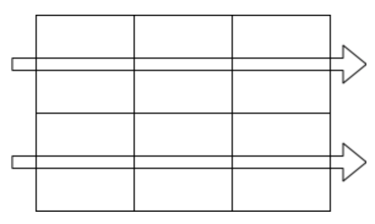
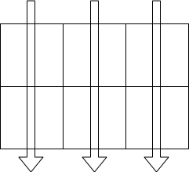
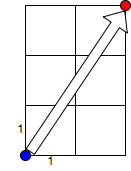
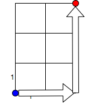

### [A問題：期末試験の成績](http://judge.u-aizu.ac.jp/onlinejudge/description.jsp?id=1632)

問題文をぐっと眺めると、入力は以下のような構成になっていることが分かります。（1つ目のサンプルケース）

|       | 生徒1 | 生徒2 | 生徒3 | 生徒4 | 生徒5 |
| :---- | :---- | :---- | :---- | :---- | :---- |
| 教科1 | 10    | 20    | 30    | 40    | 50    |
| 教科2 | 15    | 25    | 35    | 45    | 55    |

このような入力のもとで、一番得点の高い生徒を求めたいので、この表を**縦向き**に足すことを考えます。実は配列は1次元で事足りるのですが、愚直に2次元配列を使えば以下のようになります。

~~~c++
#include <iostream>
#include <vector>
#include <algorithm>
using namespace std;
int main(){
    int n,m;
    while(cin>>n>>m){
        if(n+m==0)break;
        vector<vector<int>> v(m,vector<int>(n));
        //入力を受ける
        for(int i=0;i<m;i++){
            for(int j=0;j<n;j++){
                cin>>v[i][j];
            }
        }
        //sum[j]:=j番目の生徒の得点として、表を縦向きに足しこむ
        vector<int> sum(n,0);
        for(int j=0;j<n;j++){
            for(int i=0;i<m;i++){
                sum[j]+=v[i][j];
            }
        }
        //最大値を求める
        cout<<(*max_element(sum.begin(),sum.end()))<<endl;
        
    }
}
~~~

`max_element()`は、配列内の最大要素のイテレータを返す組み込み関数（標準で用意されている）です。`#include <algorithm>`が必要です。

一般に、サイズが`[n][m]`の配列に対して

~~~cpp
for(int i=0;i<n;i++){
 	for(int j=0;j<m;j++){
    //v[i][j]に関する処理
  }
}
~~~

とすれば**横向き**に、

~~~cpp
for(int j=0;j<m;j++){
  for(int i=0;i<n;j++){
    //v[i][j]に関する処理
  }
}
~~~

とすれば**縦向き**に配列を処理できます。

##### 1次元配列による実装

1次元配列での実装は以下のようになります。

~~~cpp
#include <iostream>
#include <vector>
#include <algorithm>
using namespace std;
int main(){
    int n,m;
    while(cin>>n>>m){
        if(n+m==0)break;
        vector<int> sum(n,0);
        //入力を受けつつ足しこむ
        for(int i=0;i<m;i++){
            for(int j=0;j<n;j++){
                int score;
                cin>>score;
                sum[j]+=score;
            }
        }
        cout<<(*max_element(sum.begin(),sum.end()))<<endl;
    }
}
~~~

これも表を縦向きに足す操作ですが、入力の値を保持せずに進んでいきます。$j$番目生徒の点数を足す操作を、教科数$m$回繰り返せば良いです。

* python解

  ~~~python
  while True:
      n,m = map(int, input().split())
      if(n+m  ==0):
          break
      li = list()
      for i in range(m):
          line = [num for num in map(int, input().split())]
          li.append(line)
      ans = [0 for i in range(n)]
      for i in range(m):
          for j in range(n):
              ans[j] += li[i][j]
      print(max(ans))
  ~~~

  

計算量は、データセット数を$d$とすれば$O(nmd)=O(5000000)=O(5*10^6)$で、十分間に合います。

### [B問題：スクリーンキーボード](http://judge.u-aizu.ac.jp/onlinejudge/description.jsp?id=1633&lang=jp)

* 距離のいろいろ

まずはじめに、**マンハッタン距離**を紹介します。マンハッタン距離は、縦か横しか進めない場合に、マス目をいくつ使って行くことができるか、という距離です。普段我々が言うところの距離は**ユーグリッド距離**で、また別物です。

ユーグリッド距離：$\sqrt{2^2+3^2}=\sqrt{13}$

マンハッタン距離：$2+3=5$

 今回使うのはマンハッタン距離です。

* 実装のアイデア

  本解説では、連想配列を使った実装を紹介します。C++だと`map`、pythonだと`dict()`です。`[文字]=その文字の座標(y,x)`という風に考えて構築します。キーを文字、バリューを座標にするのです。そうすると、目的の文章の文字を順番に見ながら、座標の差分を更新する作業が簡単に行えます。座標の持ち方は`pair<int,int>`を使うと良いです。

  座標$(x_1,y_1),(x_2,y_2)$とのマンハッタン距離は、$abs(x_1-x_2)+abs(y_1-y_2)$で求められます。ここで、$abs(x)$は$x$の絶対値を返す関数です。

  文字を打つときには`OK`を押さないといけないことに注意して、答えを求めましょう。

  ~~~cpp
  #include <iostream>
  #include <vector>
  #include <algorithm>
  #include <map>
  using namespace std;
  int main(){
      int h,w;
      while(cin>>h>>w){
          if(h+w == 0)break;
          vector<string> v(h);
          map<char,pair<int,int>> mp;
          for(int i=0;i<h;i++)cin>>v[i];
          //mapに情報を格納。文字v[i][j]は(i,j)の座標にある
          for(int i=0;i<h;i++){
              for(int j=0;j<w;j++){
                  mp[v[i][j]] = pair<int,int>(i,j);
              }
          }
          string s;　//入力する文章s
          cin>>s;
          pair<int,int> now = pair<int,int>(0,0); //初期位置
          int ans=0;
          for(int i=0;i<s.size();i++){
              //次の文字の座標を取ってきて
              pair<int,int> next = mp[s[i]]; 
              //abs()の計算
              ans += abs(now.first-next.first)+abs(now.second-next.second);
              now = next;
          }
          cout<<ans + s.size()<<endl;
      }
  }
  ~~~

  この実装では、文字が存在しないことを表すアンダースコアをキーとする連想配列の値は何度も更新されてしまいますが、実際の入力でも押されないところなので特に問題ありません。

* python解

  ~~~python
  while True:
      h,w = map(int,input().split())
      if(h+w == 0):
          break
      li = list()
      # キーボードの情報を格納
      for i in range(h):
          s = input()
          li.append(s)
      d = dict()
      # dictで扱えるように変換。座標はタプルで持つ
      for i,l in enumerate(li):
          for j,char in enumerate(l):
              d[char] = (i,j)
      target = input()
      ans = 0
      now = (0,0)
      for t in target:
          next = d[t]
          ans += abs(now[0]-next[0]) + abs(now[1]-next[1])
          now = next
      print(ans + len(target))
  ~~~

計算量はデータセット数を$d$とすると$O(d(hw+|s|))=O(250000)=O(2.5*10^5)$で、十分間に合います。

>C++のmapは内部的には2分木で作られているので、一応計算量にlogをつけるべきなのですが、文字種が高々69しかないことを考えれば無に等しいので、考えません。
>
>pythonのdict()はハッシュで作られているので、そもそも何も考えなくて良いでしょう。

